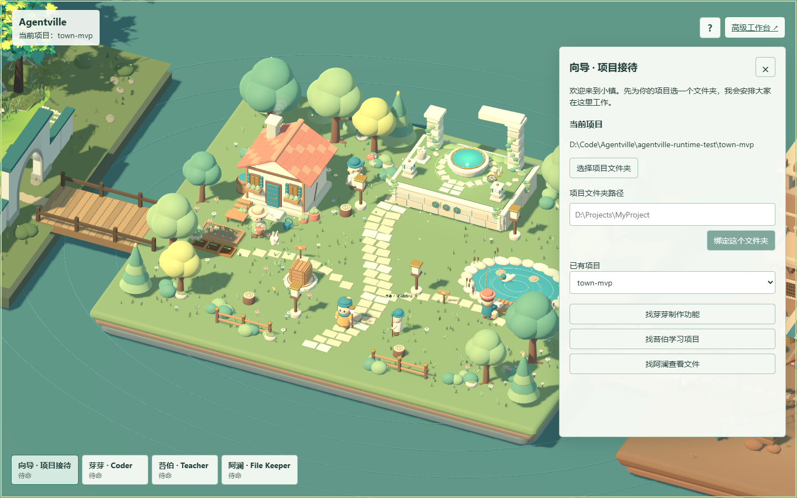
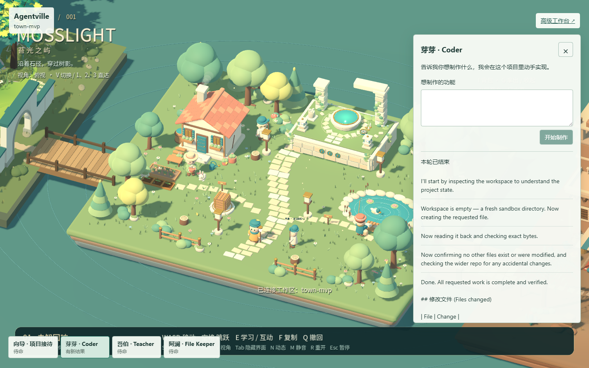
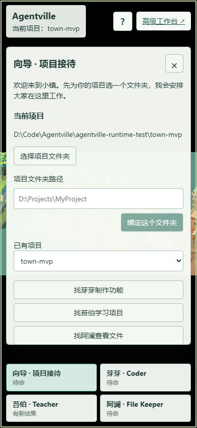

<div align="center">

# agent-isles

**让 AI 住进你的项目，在真实创作中陪你学习。**

一个以角色和可探索世界为界面的 AI 教育工作台。

<p>
  
  
  
  
  
  
</p>

<p>
  <a href="#agent-isles-是什么">产品介绍</a> ·
  <a href="#产品画面">产品画面</a> ·
  <a href="#快速开始">快速开始</a> ·
  <a href="#工作原理">工作原理</a> ·
  <a href="#文档">项目文档</a>
</p>



</div>

> [!IMPORTANT]
> agent-isles 仍处于早期开发阶段。目前提供可运行的本地 Web MVP，Windows Launcher 尚在规划中。

## agent-isles 是什么

agent-isles 把 AI 能力变成住在同一个世界里的不同居民。学习者不需要先理解复杂的模型、工具和会话概念，只需选择一个真实项目，找到合适的居民，用自然语言说明自己想学什么或做什么。

这里的学习发生在实际项目中：AI 可以读取文件、解释代码、协助实现并展示执行过程，学习者始终可以进入高级工作台查看完整对话、工具调用和审批记录。

## 当前体验

| 居民 | 职责 | 当前能力 |
| --- | --- | --- |
| 向导 | 项目接待 | 选择本地文件夹、绑定和切换 Workspace |
| 芽芽 · Coder | 制作伙伴 | 接收目标，读取、修改并验证项目 |
| 苔伯 · Teacher | 学习导师 | 结合项目文件解释概念与代码 |
| 阿澜 · File Keeper | 文件管理员 | 浏览真实目录并读取指定文件 |

- **在项目中学习**：讲解与实践共享同一个真实 Workspace。
- **角色即能力入口**：不同居民拥有清晰的职责、会话和状态。
- **过程可观察**：小镇中的人物、气泡和动画反映 AI 的工作状态。
- **保留专业界面**：高级工作台承载完整对话、工具结果和人工审批。
- **不复制执行引擎**：底层复用固定版本的 DeepSeek Harness runtime。

## 产品画面

### 与居民一起完成任务

Coder 在绑定的项目中读取和修改文件。对话、进度与最终结果直接显示在居民面板中，完整工具调用仍可在高级工作台查看。



### 在不同尺寸下使用

居民选择、项目绑定和对话面板支持窄屏布局。

<p align="center">
  
</p>

## 快速开始

### 环境要求

- Windows
- Node.js `^22.19.0` 或 `>=24.0.0`
- Corepack
- Git（包含 submodule 支持）

### 启动本地 Web

在仓库根目录运行：

```powershell
corepack enable
corepack yarn install --immutable
corepack yarn dev:web --no-open
```

打开终端输出的本地地址。首次使用时，按页面提示完成模型配置并选择一个本地项目文件夹，然后即可与居民交谈。

开发数据默认保存在仓库内的 `.agent-isles-home/`；已有 `.agentville-home/` 时会继续使用旧目录，避免丢失会话和凭据。如需更换位置，可在启动前设置 `DSH_HOME`。

## 工作原理

```text
学习者
  -> agent-isles Web：小镇、居民、对话与状态
    -> agent-isles Host/Client 插件：Workspace 与 Resident/Session 映射
      -> DeepSeek Harness：模型、工具、审批、文件与终端
        -> 本地项目
```

Godot 负责呈现世界和居民状态，React 负责 Workspace、居民选择和交互面板，DeepSeek Harness 是会话与执行状态的唯一事实来源。agent-isles 通过公开的 DSH/Cordis 插件接口接入，不修改上游源码，也不再包装一套重复的 Session API。

## 仓库结构

| 目录 | 用途 |
| --- | --- |
| `apps/web/` | 启动 agent-isles 的 DSH Web profile |
| `apps/desktop/` | 未来轻量 Windows Launcher，当前未实现 |
| `packages/agent-isles-web/` | agent-isles Host/Client Web 插件 |
| `games/mosslight/` | 使用 Blender 与 Godot 构建的世界 |
| `deepseek-harness/` | 固定版本的上游 Git submodule |
| `vendor/dsh-runtime/` | 固定并校验过的 DSH runtime 包 |
| `docs/` | 产品、架构与实施文档 |

## 开发命令

| 命令 | 用途 |
| --- | --- |
| `corepack yarn dev:web --no-open` | 构建插件并启动本地 Web |
| `corepack yarn typecheck` | 检查 Web 插件类型 |
| `corepack yarn build:web` | 构建 Web 插件 |
| `corepack yarn build:world` | 导出 Godot Web 世界 |
| `corepack yarn check:upstream` | 校验上游 submodule 版本 |
| `corepack yarn check:vendored-runtime` | 校验 vendored runtime |

## 上游与版本

当前稳定通道固定在 DeepSeek Harness `0.1.3-alpha.1`，对应 commit `d347e703908d0406b7a7ef80e3a0e594d86b2215`。版本与 runtime 产物记录在 [`upstream.json`](upstream.json) 中。

- 不直接修改 `deepseek-harness/`。
- runtime 升级先更新固定版本，再执行兼容性验证。
- agent-isles 的产品逻辑保留在自身插件和世界代码中。

## 当前限制

- Teacher 与 File Keeper 的只读行为目前由提示词约束，尚未形成强权限隔离。
- 居民与 Session 的映射保存在本地 Host 状态文件中，尚未进入 DSH runtime 持久化模型。
- 文件管理员还没有独立的文件树预览器。
- 移动端已支持面板布局，世界操作仍以键鼠为主。
- Windows Launcher、自动更新和完整分发流程尚未实现。

## 文档

- [系统架构](docs/architecture.md)
- [网页优先 MVP](docs/agent-isles-mvp-plan.md)
- [Web 定制边界](docs/web-customization.md)
- [世界与 Web 的职责](docs/world-web-plan.md)
- [居民角色设计](docs/roles.md)

## 路线图

- 将居民 Session 映射迁移到持久化 runtime。
- 在世界中展示更完整的进度、审批、错误与完成状态。
- 增加居民任务历史和“继续上次工作”。
- 提供只负责启动、健康检查与打开浏览器的轻量 Windows Launcher。
