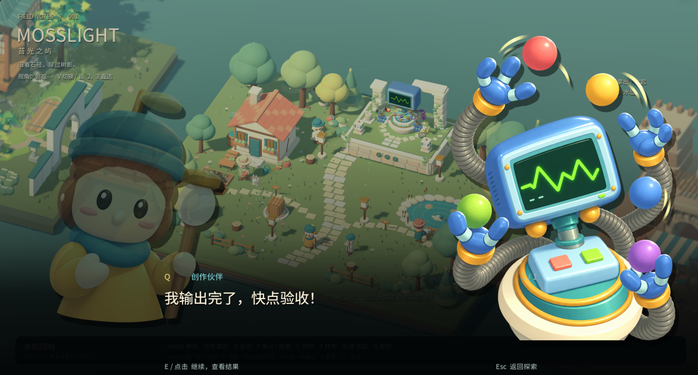

<p align="center">
  
</p>

<h1 align="center">QCode</h1>

<p align="center"><a href="README.zh-CN.md">简体中文</a> · <strong>English</strong></p>

<p align="center"><strong>Take AI coding out of the serious chat box and into an archipelago you can explore.</strong></p>

<p align="center">Build real projects with AI companions who live alongside your work, and learn coding as you create.</p>

<p align="center">
  
  
  
  
  
  
  
  <a href="https://linux.do/"></a>
</p>

<p align="center">
  <a href="https://qiuner.github.io/QCode/">Website</a> ·
  <a href="https://github.com/Qiuner/QCode/releases">Downloads</a> ·
  <a href="https://www.xiaohongshu.com/explore/6aaa7374000000002601ba97?xsec_token=ABZnBGKcFdIU_duBj-QUdqXeTQPbn-81Ek_6xvyRuJaZU=&amp;xsec_source=pc_user">Demo video</a> ·
  <a href="#community-and-feedback">Community</a> ·
  <a href="#what-is-qcode">Introduction</a> ·
  <a href="#screenshots">Screenshots</a> ·
  <a href="#quick-start">Quick start</a> ·
  <a href="#how-it-works">How it works</a> ·
  <a href="#documentation">Documentation</a> ·
  <a href="CONTRIBUTING.en.md">Contributing</a> ·
  <a href="SUPPORT.en.md">Support</a>
</p>

<a href="https://www.xiaohongshu.com/explore/6aaa7374000000002601ba97?xsec_token=ABZnBGKcFdIU_duBj-QUdqXeTQPbn-81Ek_6xvyRuJaZU=&amp;xsec_source=pc_user">
  
</a>
<p align="center"><strong><a href="https://www.xiaohongshu.com/explore/6aaa7374000000002601ba97?xsec_token=ABZnBGKcFdIU_duBj-QUdqXeTQPbn-81Ek_6xvyRuJaZU=&amp;xsec_source=pc_user">&#9654; Watch the demo video</a></strong></p>

> [!IMPORTANT]
> QCode is in early development. It currently provides a local Web MVP and a Windows x64 launcher/package preview; portable macOS Intel / Apple Silicon builds are implemented but not yet published. See the [desktop launcher guide](apps/desktop/README.en.md) for installation and build details.

**Windows portable preview:** [Download v0.1.0-preview.1](https://github.com/Qiuner/QCode/releases/tag/v0.1.0-preview.1). This historical release still uses the old executable name. New QCode builds use `QCode.exe`, store data in `%LOCALAPPDATA%\QCode\data`, and migrate the old data directory on first launch when no new directory exists. The preview is unsigned and has no automatic updates.

## What is QCode?

QCode is an explorable environment for learning and creating with AI coding. It turns Agent capabilities that normally sit behind chat boxes, terminals, and tool lists into companions, places, and actions in an island world. You can begin with an idea and work with AI to turn it into a real, runnable project without first mastering models, sessions, tool calls, or repository structure.

Choose **guided learning** to discover requirements, projects, execution, approvals, and verification while completing your first project. Or choose **free creation** to connect an existing project and explore at your own pace. Learning is attached to real work rather than separated into a course: AI can act, but you still propose, experience, judge, and refine the result.

The explorable world makes a first encounter with AI coding less intimidating without hiding its real capabilities or responsibilities. Task state is reflected in the world and its residents, while files, conversation history, and projects have clear entry points. When you need more detail, the advanced workbench exposes full conversations, tool calls, and human approvals.

## Current experience

On Windows, the installed preview starts the service and opens the island from the QCode shortcut, with its runtime and assets included. Source builds can still use `打开小岛.cmd` to open an already-running development service; this script is not the installed application entry point.

## Main features

<table>
  <tr>
    <td width="50%" valign="top">
      <h3>Workbench <sup><code>Available now</code></sup></h3>
      <p>Connect real local projects, talk with AI, inspect files and tool calls, handle approvals, and continue existing workspaces and sessions.</p>
    </td>
    <td width="50%" valign="top">
      <h3>Education and guidance <sup><code>Planned</code></sup></h3>
      <p>Turn requirements, project selection, execution, approvals, and verification into a progressive learning path for people new to AI coding.</p>
    </td>
  </tr>
  <tr>
    <td width="50%" valign="top">
      <h3>More islands <sup><code>Planned</code></sup></h3>
      <p>Expand the archipelago with distinct places, residents, and themes that give different project capabilities their own character and home.</p>
    </td>
    <td width="50%" valign="top">
      <h3>Richer ways to play <sup><code>Planned</code></sup></h3>
      <p>Connect task progress, resident relationships, exploration, and finished work through more interactions and discoveries without compromising the real workflow.</p>
    </td>
  </tr>
</table>

| Resident | Role | Current capability |
| --- | --- | --- |
| Q · Computer | Maker companion | Receives goals through full conversations and uses attachments, model settings, and permissions to read, modify, and verify projects |
| Uncle Moss | Project and history keeper | Selects and switches projects, searches history, and opens or resumes existing conversations |
| Alan · File Keeper | File keeper | Browses real directories, previews text, and shows staged, unstaged, and untracked Git changes |

- **Learn with guidance or create freely:** the tutorial helps you finish a first project, while ordinary projects open directly into creation.
- **Learn inside the project:** explanation, practice, and verification share the same real workspace.
- **Residents are capability entry points:** each resident has a clear responsibility, conversation, and state.
- **The process is visible:** characters, speech bubbles, and animation reflect the AI's working state.
- **The professional interface remains available:** the advanced workbench shows complete conversations, tool results, and human approvals.
- **No duplicate execution engine:** QCode uses a pinned DeepSeek Harness runtime underneath.

## Screenshots

### The current island and Q


Q connects to native conversations and execution for real projects. Uncle Moss manages projects and conversation history, while Alan inspects files. Web panel and narrow-screen screenshots will be recaptured; obsolete images were removed to avoid misrepresenting the current interface.

## Quick start

### Requirements

- Windows or macOS Intel / Apple Silicon for source development; see the [desktop launcher guide](apps/desktop/README.en.md) for portable previews
- Node.js `^22.19.0` or `>=24.0.0`
- Corepack
- Git with submodule support
- Godot `4.7.2` and its Web export templates when exporting the world, or a configured `GODOT_BIN`

### Start the local Web app

Run these commands from the repository root:

```powershell
corepack enable
corepack yarn install --immutable
corepack yarn dev:web --no-open
```

Open the local URL printed in the terminal. On first use, follow the interface to configure a model and select a local project directory, then talk to a resident.

Development data is stored in `.qcode-home/` inside the repository by default. An existing `.agent-isles-home/` is migrated when `.qcode-home/` does not yet exist. Set `DSH_HOME` before startup to use another location.

## Community and feedback

<p align="center">Share your creations, exchange tips, and get help in the QCode QQ community (primarily Chinese).</p>

<p align="center"><strong>QQ group: <code>543293474</code></strong> — scan with QQ or copy the number to search for the group.</p>

<p align="center">
  
</p>

<p align="center">For bugs and feature requests, use <a href="https://github.com/Qiuner/QCode/issues">GitHub Issues</a> so progress can be tracked.</p>

## How it works

```text
Creator / learner
  -> QCode Web: island world, residents, conversations, and state
    -> QCode Host/Client plugins: Workspace and Resident/Session mapping
      -> DeepSeek Harness: models, tools, approvals, files, and terminals
        -> Local project
```

Godot renders the world and resident state. React provides workspace selection and resident interaction panels. DeepSeek Harness remains the single source of truth for conversations and execution state. QCode integrates through the public DSH/Cordis plugin interfaces; it does not modify upstream source or wrap a second Session API around it.

## Repository layout

| Directory | Purpose |
| --- | --- |
| `apps/web/` | Starts the QCode DSH Web profile |
| `apps/desktop/` | Windows and macOS Intel / Apple Silicon launchers, packaging, and verification scripts |
| `packages/qcode-web/` | QCode Host/Client Web plugins |
| `games/mosslight/` | The world built with Blender and Godot |
| `deepseek-harness/` | Pinned upstream Git submodule |
| `vendor/dsh-runtime/` | Pinned and verified DSH runtime packages |
| `docs/` | Product, architecture, and implementation documentation |

## Development commands

| Command | Purpose |
| --- | --- |
| `corepack yarn dev:web --no-open` | Build the plugins and start the local Web app |
| `corepack yarn typecheck` | Type-check the Web plugins |
| `corepack yarn build:web` | Build the Web plugins |
| `corepack yarn build:world` | Export the Godot Web world |
| `corepack yarn check:upstream` | Verify the pinned upstream submodule |
| `corepack yarn check:vendored-runtime` | Verify the vendored runtime |

## Upstream and versioning

The current stable channel pins DeepSeek Harness `0.1.3-alpha.1` at commit `d347e703908d0406b7a7ef80e3a0e594d86b2215`. Versions and runtime artifacts are recorded in [`upstream.json`](upstream.json).

- Do not modify `deepseek-harness/` directly.
- Update the pinned version before running compatibility verification for a runtime upgrade.
- Keep QCode product logic in its own plugins and world code.

## Current limitations

- File Keeper read-only behavior is currently enforced by application boundaries and prompting, not a complete hard permission boundary.
- File Keeper cannot yet edit files, preview images, access remote filesystems, or show changes from a parent repository.
- The complete first lesson has not passed end-to-end verification with a real model; real tasks, recovery paths, and teaching pace still need validation.
- Panels support mobile layouts, but world controls are still designed primarily for keyboard and mouse.
- Notifications are stored in the current browser and do not sync across browsers or use operating-system notifications.
- The latest Windows installer has not yet been rebuilt and verified for installation, uninstallation, and real tasks. Preview builds are unsigned; automatic updates and a release channel are not implemented.

## Documentation

- [Desktop launcher and preview builds](apps/desktop/README.en.md)
- [Contributing guide](CONTRIBUTING.en.md)
- [Support](SUPPORT.en.md)
- [Security policy](SECURITY.en.md)
- [Code of Conduct](CODE_OF_CONDUCT.en.md)
- [Third-party notices](THIRD_PARTY_NOTICES.en.md)
- [Changelog](CHANGELOG.en.md)

Detailed architecture and implementation documents are currently maintained in Chinese under [`docs/`](docs/README.md).

## Contributing

Bug reports, feature proposals, and pull requests are welcome. Please open an Issue to align on scope before starting a large feature or interaction redesign.

Read the [contributing guide](CONTRIBUTING.en.md) for development requirements, initial setup, testing, and pull request expectations. The guide also points to the relevant technical documents for Web plugins, islands and residents, tutorials, desktop distribution, and documentation changes.

## Roadmap

- Complete end-to-end verification of a real model, the full first lesson, and major failure paths.
- Establish enforceable permission boundaries for different residents.
- Improve signing, automatic updates, and distribution for Windows builds.
- Expand lessons, project templates, and world feedback connected to task progress.
