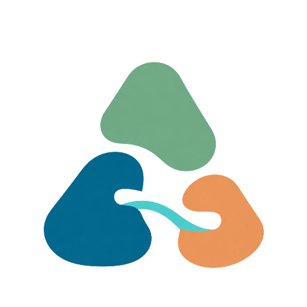
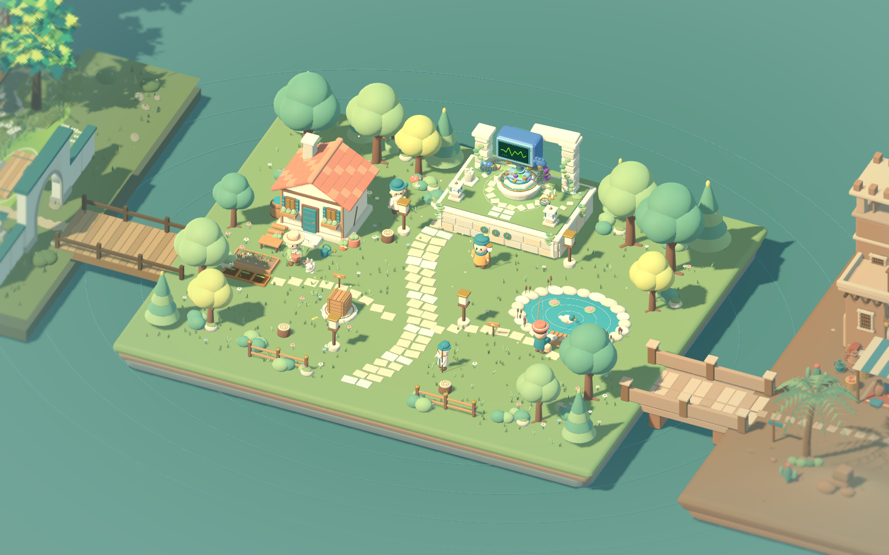

<p align="center">
  
</p>

<h1 align="center">agent-isles</h1>

<p align="center"><strong>简体中文</strong> · <a href="README.md">English</a></p>

<p align="center"><strong>把 AI 编程从严肃的聊天框，带进一片可以探索的群岛。</strong></p>

<p align="center">和住在项目里的 AI 伙伴一起做出真实作品，也在创作过程中学会 Coding。</p>

<p align="center">
  
  
  
  
  
  
  
</p>

<p align="center">
  <a href="#agent-isles-是什么">产品介绍</a> ·
  <a href="#产品画面">产品画面</a> ·
  <a href="#快速开始">快速开始</a> ·
  <a href="#工作原理">工作原理</a> ·
  <a href="#文档">项目文档</a> ·
  <a href="CONTRIBUTING.md">参与贡献</a> ·
  <a href="SUPPORT.md">获取帮助</a>
</p>


> [!IMPORTANT]
> agent-isles 仍处于早期开发阶段。目前提供本地 Web MVP、Windows x64 启动器/安装包预览；macOS Intel / Apple Silicon 便携构建已实现，公开下载待发布。安装与构建说明见 [桌面启动器](apps/desktop/README.md)。

**Windows 便携预览版**：[下载 v0.1.0-preview.1](https://github.com/Qiuner/agent-isles/releases/tag/v0.1.0-preview.1)。下载 ZIP，完整解压到较短路径后运行 `agent-isles.exe`；首次使用需配置模型。用户数据保存在 `%LOCALAPPDATA%\agent-isles\data`，退出服务使用系统托盘菜单。版本未签名、无自动更新，更新时退出旧版后将新版解压到新目录，不覆盖运行中的文件。

## agent-isles 是什么

agent-isles 是一个可探索的 AI Coding 学习与创作环境。它把原本藏在聊天框、终端和工具列表里的 Agent 能力，变成群岛世界中的伙伴、地点和行动。你不需要先弄懂模型、会话、工具调用和项目结构，就可以从一句自己的想法出发，和 AI 一起把它做成真正能运行的作品。

你可以选择“跟着学”，在完成第一个作品的过程中认识需求、项目、执行、审批和验收；也可以选择“自由创作”，直接绑定已有项目，按自己的节奏探索和修改。教学不是脱离实践的课程，而是附着在真实创作上的引导：AI 可以动手，但作品仍由你提出、体验、判断并继续完善。

可探索的群岛降低了第一次接触 AI 编程时的陌生感，但没有隐藏真实能力和责任边界。任务状态会反映在世界和角色上，文件、历史对话与项目各有明确入口；需要深入时，你仍然可以进入高级工作台查看完整对话、工具调用和人工审批。

## 当前体验

Windows 预览版通过安装包安装后，点击 agent-isles 图标即可启动服务并进入小岛，运行时和资源已内置。源码开发仍可使用 `打开小岛.cmd` 打开正在运行的开发服务；该脚本不作为安装版入口。

## 主要功能

<table>
  <tr>
    <td width="50%" valign="top">
      <h3>工作台 <sup><code>当前可用</code></sup></h3>
      <p>在本地工作台里连接真实项目，与 AI 对话，查看文件和工具调用，处理审批，并继续已有的 Workspace 与 Session。</p>
    </td>
    <td width="50%" valign="top">
      <h3>教育与引导 <sup><code>规划中</code></sup></h3>
      <p>把需求表达、项目选择、执行、审批和验收做成循序渐进的学习路径，让第一次接触 AI Coding 的人也能完成自己的作品。</p>
    </td>
  </tr>
  <tr>
    <td width="50%" valign="top">
      <h3>更多的小岛 <sup><code>规划中</code></sup></h3>
      <p>继续扩展群岛中的地点、居民和主题，把不同类型的项目能力放进各自有性格、有入口的空间。</p>
    </td>
    <td width="50%" valign="top">
      <h3>更丰富有意思的玩法 <sup><code>规划中</code></sup></h3>
      <p>让任务进展、居民关系、探索和作品成果产生更多互动，在不牺牲真实工作流的前提下，增加值得发现和反复体验的反馈。</p>
    </td>
  </tr>
</table>

| 居民 | 职责 | 当前能力 |
| --- | --- | --- |
| Q · 计算机 | 制作伙伴 | 通过完整对话接收目标，使用附件、模型与权限设置读取、修改并验证项目 |
| 苔伯 | 项目与历史管理员 | 选择和切换项目、搜索历史，并查看或继续已有对话 |
| 阿澜 · File Keeper | 文件管理员 | 浏览真实目录、预览文本，并查看 Git 暂存、未暂存与未跟踪修改 |

- **跟着学，也能自由做**：教程帮助你完成第一个作品，普通项目支持直接进入创作。
- **在项目中学习**：讲解、实践和验收共享同一个真实 Workspace。
- **角色即能力入口**：不同居民拥有清晰的职责、会话和状态。
- **过程可观察**：群岛中的角色、气泡和动画反映 AI 的工作状态。
- **保留专业界面**：高级工作台承载完整对话、工具结果和人工审批。
- **不复制执行引擎**：底层复用固定版本的 DeepSeek Harness runtime。

## 产品画面

### 当前小岛与 Q


Q 连接真实项目的原生对话与执行过程；项目和历史由苔伯管理，文件由阿澜查阅。网页面板和窄屏截图待重新采集，已移除旧版画面，避免与当前界面混淆。

## 快速开始

### 环境要求

- Windows 或 macOS Intel / Apple Silicon（源码开发；便携预览见 [桌面启动器](apps/desktop/README.md)）
- Node.js `^22.19.0` 或 `>=24.0.0`
- Corepack
- Git（包含 submodule 支持）
- 导出世界时需要 Godot `4.7.2` 与 Web 导出模板（或设置 `GODOT_BIN`）

### 启动本地 Web

在仓库根目录运行：

```powershell
corepack enable
corepack yarn install --immutable
corepack yarn dev:web --no-open
```

打开终端输出的本地地址。首次使用时，按页面提示完成模型配置并选择一个本地项目文件夹，然后即可与居民交谈。

开发数据默认保存在仓库内的 `.agent-isles-home/`。如需更换位置，可在启动前设置 `DSH_HOME`。

## 交流与反馈

<p align="center">欢迎加入 agent-isles 用户交流群，分享作品、交流使用心得、获取使用帮助。</p>

<p align="center"><strong>QQ 群：<code>543293474</code></strong> — 使用 QQ 扫码，或复制群号搜索加入。</p>

<p align="center">
  
</p>

<p align="center">Bug 和功能建议请提交到 <a href="https://github.com/Qiuner/agent-isles/issues">GitHub Issues</a>，方便跟踪处理进展。</p>

## 工作原理

```text
创作者 / 学习者
  -> agent-isles Web：群岛世界、角色、对话与状态
    -> agent-isles Host/Client 插件：Workspace 与 Resident/Session 映射
      -> DeepSeek Harness：模型、工具、审批、文件与终端
        -> 本地项目
```

Godot 负责呈现世界和居民状态，React 负责 Workspace、居民选择和交互面板，DeepSeek Harness 是会话与执行状态的唯一事实来源。agent-isles 通过公开的 DSH/Cordis 插件接口接入，不修改上游源码，也不再包装一套重复的 Session API。

## 仓库结构

| 目录 | 用途 |
| --- | --- |
| `apps/web/` | 启动 agent-isles 的 DSH Web profile |
| `apps/desktop/` | Windows / macOS Intel / Apple Silicon 启动器、打包与验证脚本 |
| `packages/agent-isles-web/` | agent-isles Host/Client Web 插件 |
| `games/mosslight/` | 使用 Blender 与 Godot 构建的世界 |
| `deepseek-harness/` | 固定版本的上游 Git submodule |
| `vendor/dsh-runtime/` | 固定并校验过的 DSH runtime 包 |
| `docs/` | 产品、架构与实施文档 |

## 开发命令

| 命令 | 用途 |
| --- | --- |
| `corepack yarn dev:web --no-open` | 构建插件并启动本地 Web |
| `corepack yarn typecheck` | 检查 Web 插件类型 |
| `corepack yarn build:web` | 构建 Web 插件 |
| `corepack yarn build:world` | 导出 Godot Web 世界 |
| `corepack yarn check:upstream` | 校验上游 submodule 版本 |
| `corepack yarn check:vendored-runtime` | 校验 vendored runtime |

## 上游与版本

当前稳定通道固定在 DeepSeek Harness `0.1.3-alpha.1`，对应 commit `d347e703908d0406b7a7ef80e3a0e594d86b2215`。版本与 runtime 产物记录在 [`upstream.json`](upstream.json) 中。

- 不直接修改 `deepseek-harness/`。
- runtime 升级先更新固定版本，再执行兼容性验证。
- agent-isles 的产品逻辑保留在自身插件和世界代码中。

## 当前限制

- File Keeper 的只读行为目前由应用边界和提示词共同约束，尚未形成完整的强权限隔离。
- File Keeper 暂不支持编辑文件、预览图片、访问远程文件系统或展示父级仓库的修改。
- 完整首课尚未通过真实模型的端到端验收，真实任务、异常恢复和教学节奏仍需继续验证。
- 移动端已支持面板布局，世界操作仍以键鼠为主。
- 通知保存在当前浏览器中，暂不跨浏览器同步，也不提供操作系统通知。
- 最新 Windows 安装包尚未重新构建并完成安装、卸载与真实任务验收；预览版未签名，自动更新和发布渠道尚未实现。

## 文档

- [系统架构](docs/architecture.md)
- [网页优先 MVP](docs/agent-isles-mvp-plan.md)
- [Web 定制边界](docs/web-customization.md)
- [世界与 Web 的职责](docs/world-web-plan.md)
- [居民角色设计](docs/roles.md)
- [发布检查清单](docs/release-checklist.md)

## 参与贡献

Bug 报告、功能建议和 Pull Request 都欢迎。较大的功能或交互调整建议先通过 Issue 对齐范围。

贡献前先阅读：

1. [贡献指南](CONTRIBUTING.md)：开发工具版本、环境准备、首次启动、测试与 PR 要求。
2. [仓库约束](AGENTS.md)：代码边界、提交规则和施工文档维护；修改某个目录前，再阅读该目录的 `AGENTS.md`。
3. [文档门户](docs/README.md)：按贡献方向找到相关规范，无需通读全部文档。

再按本次改动选择专项文档：

| 贡献方向 | 开始前阅读 |
| --- | --- |
| Web / Host 插件 | [插件开发指南](packages/agent-isles-web/docs/plugin-development.md)、[总体架构](docs/architecture.md) |
| 新岛屿、居民与世界交互 | [岛屿接入契约](docs/world-integration-contract.md)、[世界开发说明](games/mosslight/README.md) |
| 教程流程 | [教程架构](docs/tutorial-architecture.md)、[首课施工记录](docs/first-vibe-coding-tutorial-plan.md) |
| Windows 启动器与发行 | [桌面说明](apps/desktop/README.md)、[发布检查清单](docs/release-checklist.md) |
| 文档 | [文档维护指南](docs/documentation-guide.md) |

- [获取帮助](SUPPORT.md)
- [安全策略](SECURITY.md)
- [社区行为准则](CODE_OF_CONDUCT.md)
- [变更日志](CHANGELOG.md)

## 路线图

- 完成真实模型、完整首课和主要异常路径的端到端验收。
- 为不同居民建立可执行的强权限边界。
- 完善 Windows 安装包的签名、自动更新和发布渠道。
- 扩展课程、作品模板，以及与任务进展联动的世界反馈。
