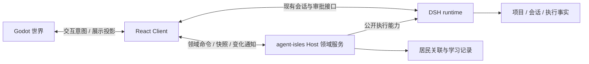
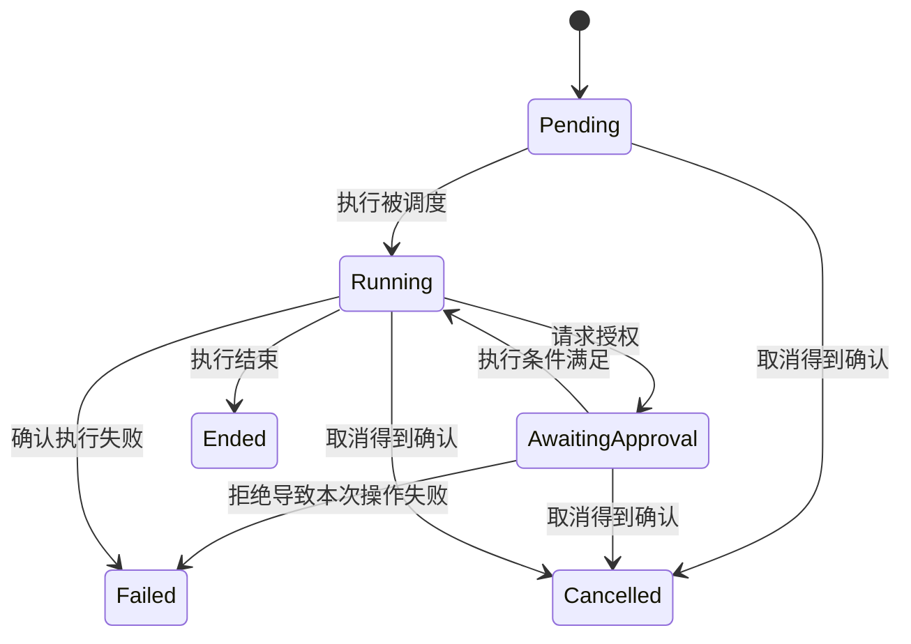

# agent-isles 总体架构

本文定义系统的职责边界、对象生命周期、状态转换、持久化一致性及接口与事件契约。它用于约束设计和实现；开发操作、文件位置、页面交互和施工进度由专项文档维护。

文档分工：本文完整定义跨领域通用契约；[教程架构](tutorial-architecture.md) 只定义教学领域的数据、状态、接口和验收差异。专项文档引用通用契约，不重复定义；教学规则不在本文展开。

状态：以下是目标架构契约，复用已有 DSH / Cordis 能力；尚未落实的部分在末节列明。文中的状态名称是业务语义，不要求复制为 DSH 内部枚举，也不要求引入独立状态机框架。

## 1. 系统边界与责任

agent-isles 将真实项目中的创作与学习组织为居民交互。执行与教学是两个不同的责任域：DSH 决定任务如何执行并记录执行事实；agent-isles 决定居民关联、学习目标与验收结论。

| 责任域 | 拥有的能力与决策 | 不拥有的状态 |
| --- | --- | --- |
| 运行宿主 / Launcher | Host 进程存活、正常关闭与异常回收 | 会话结果、学习进度 |
| DSH runtime | Workspace、Session、执行、工具权限、审批、模型配置与凭据 | 教程步骤是否满足教学目标 |
| agent-isles Host 插件 | 居民关联、教程定义、学习记录、检查协调与验收 | DSH 的执行历史与权限实现 |
| React Client | 提交用户意图、读取业务快照、维护交互状态 | 权威执行结果与学习进度 |
| Godot 世界 | 空间交互与业务状态的可视化投影 | 会话、审批、验收与持久化关联 |

Host 插件与 DSH 可以同进程部署，业务边界不等于进程边界。Cordis 提供服务依赖和资源生命周期；只为居民与教程等自身领域提供服务，不再包装整套 Session API。

全局不变量：

- 一个事实只有一个权威写入方；其他层只能读取、引用或投影。
- 任务执行、用户交互、插件存活和学习进度的生命周期彼此独立。
- 执行结束与领域目标达成是不同事实，后者由相应领域按规则判断。
- 教程附着于项目，共用自由创作的会话与执行能力，不改变全局运行模式。
- 客户端和模型输出不能直接变更权威验收结果或授予执行权限。

## 2. 对象与生命周期

### 2.1 对象关系

| 对象 | 身份与关联 | 生命周期所有者 |
| --- | --- | --- |
| Workspace | DSH 项目标识；关联真实项目目录 | DSH |
| Resident | 稳定居民标识，与具体 Session 分离 | agent-isles |
| ResidentBinding | 关联 Workspace、Resident 与当前复用的 Session | agent-isles Host |
| Session | 归属 Workspace，可承载多轮执行；不等同于单次任务 | DSH |
| 执行操作 | 一次提交或可追踪的执行，引用 DSH 标识 | DSH |
| TutorialRun | 通过 Workspace 与执行引用接入系统的学习记录；内部对象见教程架构 | agent-isles Host |

当前居民关联表达“当前复用会话”，不能代替完整任务历史。教程的定义、检查对象及项目内数量约束由 [教程领域模型](tutorial-architecture.md#2-领域模型与持久化聚合) 维护。

### 2.2 生命周期归属与结束条件

| 对象 | 建立条件 | 存续条件 | 结束及清理责任 |
| --- | --- | --- | --- |
| Host 进程 | 宿主启动运行环境 | 不依赖某个浏览器是否在线 | 宿主协调正常退出，异常时回收其拥有的进程 |
| Cordis 插件实例 | 必要依赖可用，资源建立成功 | 依赖满足且未被卸载 | 停止接收操作，释放自身任务、订阅与资源 |
| Workspace | 用户绑定或创建项目 | 与当前是否选中无关 | 删除语义由 DSH 决定，不因切换而销毁 |
| ResidentBinding | 确认 Session 存在且归属匹配 | 被引用对象有效 | 失效时标明原因，不静默创建替代关系 |
| Session / 执行 | DSH 接受相应操作 | 与面板和居民选择无关 | 由 DSH 完成或显式取消，记录结果 |
| Client 订阅 | 建立连接并选择观察对象 | 连接与观察范围有效 | 断线、切换范围或卸载时释放 |

插件关闭顺序为：停止接收新命令 → 处理自身拥有的进行中操作 → 排空已接受的持久化写入 → 释放存储和依赖。正常关闭需有时间上限；强制终止后的未决操作由恢复逻辑处理。

资源必须登记到 Cordis 生命周期。框架不会自动取消任意 Promise 或子进程。插件只能清理它拥有的操作，不得连带取消其他所有者的任务。

## 3. 状态模型与转换约束

状态按责任域分别维护，不组合成一个全局“工作中”状态。居民状态是执行事实的投影，不是另一套可写执行状态。

### 3.1 业务服务可用性

| 状态 | 可接受操作 | 转换条件 |
| --- | --- | --- |
| 恢复中 | 健康信息及恢复状态读取 | 数据与依赖就绪后进入可用；失败则不可用 |
| 可用 | 在权限及业务前置条件满足时接受命令 | 关闭或依赖失效时进入收尾 |
| 收尾中 | 已有操作状态查询，拒绝新业务写入 | 已接受操作与资源收尾后停止 |
| 不可用 / 已停止 | 不接受业务命令 | 重新建立实例并恢复后才可再次可用 |

这里约束业务入口，不替换 Cordis 自身插件状态。缺少执行依赖不应阻止独立的只读业务能力。

### 3.2 执行状态与观察状态

图表示产品需要理解的单次操作语义，不是 DSH 状态枚举的替代实现。审批拒绝也可能由 DSH 反馈给模型继续处理，最终转换以 DSH 事实为准。

“断线”“超时”“结果未知”属于观察或请求状态，不足以将执行改为失败。取消请求已发出不等于取消成功，必须等待执行所有者确认。一个操作结束不表示整个 Session 被关闭。

## 4. 数据所有权与持久化

### 4.1 权威数据、引用与派生数据

| 数据 | 权威写入方 | 持久化及恢复原则 |
| --- | --- | --- |
| Workspace、Session、执行与审批事实 | DSH | 使用原有持久化，产品层不复制完整历史 |
| 模型配置与凭据 | DSH | 使用其设置与凭据接口，不另建产品密钥库 |
| 居民关联 | agent-isles Host | 保存稳定标识，恢复时验证引用有效性与项目归属 |
| 教程定义与学习记录 | agent-isles 教程域 | 引用项目与执行事实；聚合结构和内容版本规则由教程架构定义 |
| 项目作品 | 用户项目文件 | 与业务状态分开，不将文件修改视为数据库事务的一部分 |
| 草稿与呈现状态 | Client | 可本地保存，不承担权威进度或执行恢复 |
| 居民动作、摘要与通知 | 派生层 | 可由事实重建，不能反向覆盖来源数据 |

自有领域持久化优先复用 DSH 领域存储。借用存储设施不转移领域数据所有权；聚合结构和数据迁移由各领域负责。

### 4.2 一致性与写入边界

- 同一聚合内的读、条件判断和更新在同一串行更新边界执行；不能读取旧值后无条件覆盖。
- 先完成持久化，再更新可观察状态并发布变化。通知失败不回滚已落盘事实，也不能误报为命令尚未执行。
- 本地状态写入、DSH 操作与项目文件变更不共享一个事务。跨域操作必须保留可恢复身份，识别部分成功。
- 同一请求标识必须绑定相同业务参数。重复请求返回既有操作；同标识不同参数返回冲突。
- 引用校验同时检查存在性与归属。无效或歧义关联需要处理，不能仅按显示名称自动匹配。
- 权威数据损坏应显式暴露恢复失败；只有可重建派生数据可以丢弃重建。

快照版本用于并发控制，操作身份用于幂等，两者不能互相替代。记录更新时间也不能替代单调 revision。

### 4.3 版本与删除语义

数据格式版本、领域内容版本和通信协议版本独立管理。迁移必须明确旧数据如何读取、转换和保留；不支持的版本停止相关操作，不静默重置。

解除关联不删除 Session，卸载插件不删除业务记录。被引用对象失效后保留必要历史及失效引用，直到按明确的领域规则处理。具体删除和数据清理需独立定义，不能借故障恢复顺便执行。

## 5. 接口契约

接口以业务命令、查询和订阅区分。具体方法名与传输格式由专项设计确定，总架构规定执行语义。

| 接口类别 | 责任 | 返回语义 |
| --- | --- | --- |
| 领域命令 | Host 校验身份、归属、权限、版本及业务条件后改变状态 | 同步操作返回已保存结果；长操作返回已接受的操作身份 |
| 快照查询 | 返回指定对象的权威当前状态 | 包含观察范围、revision 及进行中操作，不触发任务执行 |
| 变化订阅 | 通知观察范围内已确认的变化 | 不承担命令执行或唯一恢复来源 |
| DSH 执行与审批 | 直接复用 DSH 公开契约 | 以 runtime 的接受、执行及取消结果为准 |
| 世界交互接口 | 传递交互意图与最小展示投影 | 不提供直接改写进度、执行工具或授权的入口 |

自有领域命令应携带项目与对象标识、requestId；依赖当前状态的修改携带预期 revision。Host 返回的错误应区分参数无效、引用失效、权限拒绝、状态冲突、依赖不可用和持久化失败，不能全部压成“任务失败”。

请求超时表示调用方没有及时取得答复，不证明 Host 未执行。调用方应先按操作身份查询；对没有幂等保证的执行，不自动重发。

授权和归属必须在 Host 验证。Client 状态、居民提示词或消息来源合法，只是输入条件，不能取代业务授权。

## 6. 事件传播与时序

### 6.1 事件的含义与顺序

Host 内部复用 Cordis 事件。服务调用表达“执行某操作”，事件表达“某事实已经改变”。核心持久化和权限决策不能依赖不等待结果的事件广播完成。

变化通知至少标明观察对象、项目归属和 revision；需要关联命令时携带 requestId 或操作身份。只要求同一聚合按版本判断新旧，不要求所有项目拥有全局顺序。

跨端不假设恰好一次送达。消费者需要容忍重复、迟到和丢失：丢弃旧 revision，发现缺口重新读取快照。内部存储事件不能未经筛选直接暴露完整业务记录。

### 6.2 状态变更的时间边界

自有领域操作遵守以下先后关系：

1. 在写入边界内验证业务条件并完成持久化。
2. 持久化成功后，才将新状态暴露为已确认结果。
3. 变化通知只能描述已确认状态；命令答复与通知的网络到达顺序不作保证。

长操作的“已接受”与“已完成”是两个独立持久化边界，中间的外部执行不属于本地事务。每个领域负责定义接受记录、执行关联及未决操作的恢复条件，具体业务时序由专项架构维护。

### 6.3 连接恢复与订阅边界

Client 建立观察时需要取得快照基线，并保证基线之后的变化不会静默遗漏。实现可采用带游标的订阅、订阅后读取并按版本对齐，或周期快照；不得在无法补偿的“先读再订阅”空隙中丢掉更新。

切换项目或断线后释放旧订阅，拒绝旧观察范围的迟到响应。恢复连接只恢复观察，不自动再次提交任务。世界表现随 Client 投影重建，不参与业务恢复决策。

DSH Remote 的事件转发有显式选择范围，并不自动传输全部 Cordis 事件。领域跨端扩展必须遵守现有注册边界；所需接口未验证前，不假定新增事件可以直接到达浏览器。

## 7. 故障与恢复契约

| 故障边界 | 不能推断的结论 | 恢复责任 |
| --- | --- | --- |
| Client 断线 | 任务失败或已经取消 | Client 重取快照；Host 保留任务事实 |
| 命令答复丢失 | 命令尚未执行 | 按请求或操作身份核对，避免重复副作用 |
| 执行成功但业务写入失败 | 领域状态已经更新 | 操作所有者核对执行依据，恢复尚未完成的领域写入 |
| Session 已创建但关联未保存 | 创建完全失败，需要再建一个 | Host 核对已创建身份，补全关联 |
| 插件依赖失效 | 所有项目任务都应取消 | 停止相应能力，清理该插件拥有的操作 |
| Host 异常退出 | 未决操作必然失败或通过 | 恢复持久记录，核对 DSH；不确定结果标明中断 |
| 世界渲染失败 | 执行状态发生改变 | 重建展示，不修改业务状态 |
| 领域内容或记录版本不可读取 | 用户没有历史数据 | 暴露兼容问题，保留原记录并停止相关写入 |

恢复动作优先修复关联与观察，不能删除作品、重置权威状态或自动重放不可确认的外部副作用。对无法自动恢复的问题保留操作身份与失败阶段，供显式处理。

## 8. 信任、隔离与兼容边界

| 边界 | 架构约束 |
| --- | --- |
| Host 与官方插件 | 同进程可信代码；Cordis 隔离只管理服务作用域 |
| Client / 世界与 Host | 外部输入必须校验来源、结构、身份、归属与权限 |
| 声明式内容与可执行扩展 | 内容数据不自动获得插件权限；可执行扩展必须经过独立信任决策 |
| 工具与用户项目 | 由 DSH 执行权限与可用沙箱约束；子进程本身不等于安全隔离 |
| 发布物与运行宿主 | 签名与完整性验证证明来源，不能替代运行时授权 |
| 插件与固定 runtime | 以公开服务与协议为兼容契约，不依赖上游内部实现 |

角色权限应在执行边界落实，不以居民名称或提示词代替。签名由发布流程与运行宿主负责，进程回收由宿主负责，业务取消由操作所有者负责，三者不能混同。

进程重启与插件重载不能改变持久化记录语义。协议或数据版本不兼容时显式拒绝或迁移；不能通过静默降级丢弃审批、检查或执行信息。

## 9. 当前实现差距与专项设计

本文规定目标契约，不将现有局部实现视为完整保证：

| 领域 | 当前限制 |
| --- | --- |
| 居民关联 | Host 保存文件，Client 仍负责部分会话选择与创建；未实现集中式跨客户端幂等与归属协调 |
| 持久化 | 现有居民写入队列不提供跨进程或跨 DSH 操作事务；教程领域存储尚未接入 |
| 教程 | 生命周期、验收与恢复设计已采用，功能尚未实施 |
| 跨端同步 | 新领域 revision、操作查询及订阅注册需要验证，不能假定现有接口全部满足本文契约 |
| 执行权限 | Teacher / File Keeper 当前主要受提示词约束；强角色权限及检查隔离需验证 |
| 运行宿主 | Launcher、签名验证与完整进程退出管理尚未实施 |

详细教学契约见 [教程架构](tutorial-architecture.md)；当前工作恢复与历史验收见 [居民工作闭环](resident-work-loop.md)。这些文档中的当前实现与历史方案须按状态标识阅读，不覆盖本文的目标责任划分。

长期决策：[DSH 插件边界](../.agents/notes/implemented/architecture/2026-09-08-dsh-plugin-runtime-boundary.md)、[轻量 Launcher](../.agents/notes/implemented/architecture/2026-09-09-web-ui-with-thin-windows-launcher.md)、[项目学习记录](../.agents/notes/implemented/architecture/2026-09-11-project-tutorial-runs.md)、[教程基础设施](../.agents/notes/implemented/architecture/2026-09-11-tutorial-plugin-boundary.md)、[教程信任边界](../.agents/notes/implemented/architecture/2026-09-11-declarative-tutorial-content.md)。
