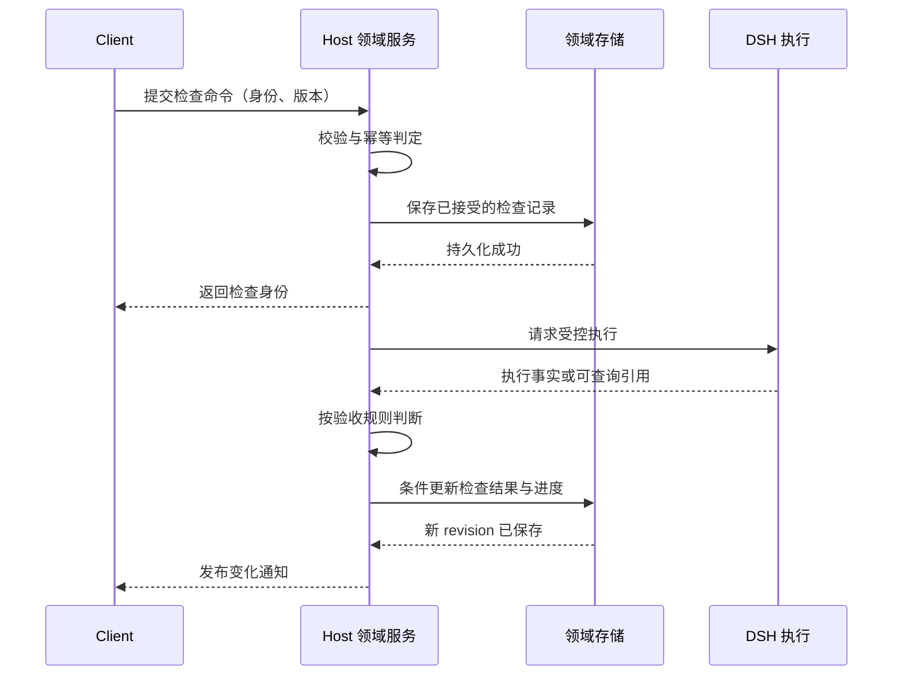

# 教程与自由创作架构

状态：设计方向已采用，首课已有实现，完整验收范围见[首课施工记录](first-vibe-coding-tutorial-plan.md#8-本轮施工记录2026-09-11)。本文定义教学领域的对象、学习状态、验收规则及接口语义；服务名与数据字段为目标契约，不表示通用教程引擎均已实现。

## 1. 范围与继承关系

教程是附着于 Workspace 的学习活动。首版支持领取教程、准备练习项目、分级提示、步骤检查、暂停、继续和完成后自由创作。课程市场、通用课程编排引擎及自动判定用户掌握程度不在首版范围。

本文继承 [总体架构](architecture.md)，以下规则只在总架构维护：

| 通用契约 | 规范位置 |
| --- | --- |
| Host、DSH、Client、世界的职责及插件资源清理 | [系统边界](architecture.md#1-系统边界与责任)、[对象生命周期](architecture.md#2-对象与生命周期) |
| 权威写入、事务边界、幂等、数据迁移 | [数据与持久化](architecture.md#4-数据所有权与持久化) |
| 命令、查询、订阅及通用错误语义 | [接口契约](architecture.md#5-接口契约) |
| revision、通知可靠性、断线与订阅恢复 | [事件与时序](architecture.md#6-事件传播与时序) |
| 进程、权限、签名及隔离责任 | [信任与隔离](architecture.md#8-信任隔离与兼容边界) |

本篇只补充这些契约在教学领域中的具体对象和约束。教程定义、学习记录和检查由教程领域服务管理；不再列一套 Launcher、React、Godot 的组件职责。

## 2. 领域模型与持久化聚合

### 2.1 对象与关联

| 对象 | 教学语义 | 主要内容 |
| --- | --- | --- |
| TutorialDefinition | 一个固定版本的课程定义 | tutorialId、version、templateVersion、稳定 stepId、学习目标、提示、检查定义 |
| TutorialRun | 一个项目的一次学习记录 | runId、workspaceId、锁定的课程版本、准备阶段、状态、当前步骤、revision、步骤结果与协助记录 |
| StepCheck | 某一步的一次验收尝试 | checkId、requestId、stepId、检查定义版本、执行引用、起止时间、结果与证据摘要 |

TutorialRun 引用 DSH Workspace；StepCheck 引用 DSH 执行依据。居民用于提供引导，居民会话的选择与关联遵守现有居民领域契约，不由教程另建一套 Session 管理。

首版每个 Workspace 最多有一条未完成 TutorialRun，准备中和暂停均占用此名额；历史完成记录可以有多条。课程、学习记录和步骤是数据，不分别实例化插件。

### 2.2 聚合与并发边界

TutorialRun 是学习进度的更新聚合，首版将当前检查及必要检查历史嵌入其中。步骤结果、当前检查身份和完成状态在该聚合的一次更新内修改，避免出现“检查通过但进度仍指向旧步骤”的部分写入。

同一项目的领取判定需要串行执行，并检查包括准备中记录在内的未完成学习记录。未创建 Workspace 的准备请求先按 requestId 保留可恢复身份，取得项目标识后补齐关联。接受记录及项目资源之间的恢复关系见第 5.2 节。

重查使用新的 checkId。结果提交同时核对 runId、stepId 与当前 checkId；操作期间发生暂停等合法更新时，应读取最新学习记录再合并结果，不能因旧 revision 直接丢弃已确认的执行依据，也不能覆盖新的检查。

检查历史可以限制保留数量，但最终验收、仍在执行及尚未完成恢复的检查依据不能因截断历史被删除。完整执行输出由 DSH 保管，学习记录只保存教学所需摘要与引用。

### 2.3 课程版本与作品

学习开始后固定 tutorialId、课程版本和模板版本。仍有关联记录需要继续学习时，应保留相应课程版本，或提供明确迁移；缺失版本阻止继续，不自动采用最新版规则重新解释历史结果。

教程完成后，作品继续用于自由创作。重做默认创建新的练习项目和学习记录；暂停、重做或准备失败均不能覆盖已有作品。历史完成记录保留当时的课程版本与验收依据。

## 3. 学习生命周期与状态

### 3.1 学习与检查转换

| 对象 | 转换 | 守卫条件及结果 |
| --- | --- | --- |
| 学习记录 | 准备中 → 学习中 | 项目与锁定的教程版本可用，初始记录已保存 |
| 学习记录 | 学习中 ↔ 暂停 | 显式命令且版本匹配；不自动取消执行 |
| 学习记录 | 学习中 → 已完成 | 必需目标按各自验收规则满足，最终记录保存成功 |
| 检查 | 待执行 → 执行中 | 唯一检查请求被接受，执行引用可关联 |
| 检查 | 执行中 → 通过 / 未通过 | 执行结果可确认，验收器依据对应规则给出结论 |
| 检查 | 待执行 / 执行中 → 失败 / 中断 / 已取消 | 区分执行错误、结果不可确认和确认取消；都不推进为通过 |

暂停期间已发出的检查可以保存结果，但不能自动启动下一步或将暂停记录自动结课；继续时重新评估完成条件。重查创建新的检查身份，旧检查的迟到结果不能覆盖当前检查。

已完成的教程是历史学习记录，不保证当前项目文件永远满足条件。作品被修改后可重新检查，不能据新文件状态悄悄改写历史验收证据。

### 3.2 暂停、重查与准备失败

暂停保留当前步骤和草稿归属。已开始检查的结果按第 3.1 节保存，是否继续教学由显式继续命令决定。

检查失败、未通过或中断不会结束 TutorialRun，学习者可以调整作品后重查。已完成记录若需要核验修改后的作品，应生成新的核验尝试；不得回写或覆盖原结课证据。

项目准备失败保留准备阶段与已创建资源引用，记录继续占用未完成名额。再次领取不能绕过失败记录创建第二条活动课程，应继续准备或显式处理该记录。首版不通过自动删除项目解除这一约束。

## 4. 教学接口与结果语义

以下是业务操作契约，实际方法名与传输层待接入验证。requestId、revision 和通用错误按总架构处理，下表仅列教学特有条件。

| 操作 | 教学输入与前置条件 | 教学结果 |
| --- | --- | --- |
| 领取教程 | 指定课程版本、练习项目创建参数；无冲突的未完成记录 | 返回准备身份及后续 runId，或已有准备结果 |
| 读取学习快照 | runId 或 workspaceId | 返回锁定课程、准备状态、当前步骤、结果、协助记录及当前检查 |
| 暂停学习 | 学习中记录 | 记录转为暂停，当前检查按既定语义收尾 |
| 继续学习 | 暂停记录；项目与课程版本可用 | 重新评估步骤条件，进入学习中或确认已满足结课条件 |
| 检查步骤 | 步骤允许验收，记录处于学习中，当前没有冲突检查 | 返回 checkId；最终结果按规则更新该步骤 |
| 查询准备或检查 | 准备请求身份或 runId / checkId | 用于取得长操作状态及恢复答复丢失的请求 |
| 取消检查 | 指定当前未结束的 checkId | 返回取消进展；确认取消后保留该次尝试，学习记录不随之删除 |
| 记录协助 | 对应 runId、stepId 与实际发生的协助类型 | 保存提示方向、共同完成或代做并讲解的记录 |

最终结果有三个相互独立的维度：

- **检查依据**：确定性检查、AI 反馈或用户确认，由步骤定义指定允许的验收方式。
- **目标结果**：通过、未通过；与执行失败、中断、已取消分别表示。
- **协助程度**：提示、共同完成、代做；通过不能抹去协助记录，也不自动得出独立掌握结论。

确定性检查需要实际规则证据，不能由模型一句“完成了”替代。AI 反馈和用户确认可以满足课程明确允许的目标，但必须保留对应依据类型。

## 5. 教学操作时序与恢复

### 5.1 步骤检查时序

该时序是目标契约，不意味着存储与 DSH 执行之间存在原子提交。若在接受后、执行前崩溃，或执行后、结果保存前崩溃，恢复必须根据记录和执行引用核对；无法确认时标记中断，不能盲目重放。

### 5.2 领取与检查的恢复点

| 教学阶段 | 必须保留的依据 | 恢复动作 |
| --- | --- | --- |
| 领取已接受、项目未建立 | 请求身份、课程与模板版本、准备阶段 | 核对项目创建结果；不能仅因答复丢失创建第二份项目 |
| Workspace 已创建、模板未就绪 | Workspace 引用、已完成准备步骤 | 在确认不会覆盖作品的前提下继续准备 |
| 模板就绪、学习记录未完成初始化 | 准备身份与项目引用 | 补全同一次 TutorialRun，不能重新领取 |
| 检查已接受、执行是否开始未知 | checkId 与可获得的执行关联 | 核对执行事实；不能确认则标记中断 |
| 执行已结束、教学结果未保存 | 执行依据、规则版本与检查身份 | 对同次检查恢复验收写入，保留最新暂停状态 |
| 新检查已开始、旧结果迟到 | 新旧 checkId 与各自结果 | 保留旧尝试的依据，不覆盖当前检查或步骤结果 |
| 结课后项目文件变化 | 原结课依据与新的文件状态 | 新建核验尝试，不改写历史结课事实 |

文件检查证据包含规则版本、检查时间与可获得的输入指纹。若执行期间文件会变化，验收器应绑定可识别的文件版本、检查前后比较或使用稳定快照；无法证明结果对应当前文件时，不展示为当前有效。

首版无法持续追踪作品变更时，应明确检查仅对应当时所观察的作品。教学验收不能承诺项目之后的所有修改仍符合目标。

## 6. 教学事件与呈现投影

教程变化通知暂称 `tutorial/changed`，观察范围为 workspaceId 与 runId，版本为 TutorialRun 的 revision；涉及检查时携带 checkId。事件表示学习聚合变化，不携带完整聊天与工具输出。

通知触发点包括准备状态变化、暂停或继续、检查状态与结果、协助记录变化和结课。若一次更新同时改变检查与步骤，应作为同一 revision 的聚合变化呈现，不能让客户端自行拼成权威进度。

学习快照是教程界面的读取模型。世界只需要当前目标和学习活动的展示摘要，不增加第二份步骤历史或独立推进机制。通知顺序、重复处理和重连方式统一遵守 [总架构事件契约](architecture.md#6-事件传播与时序)。

## 7. 教程内容与验收器约束

课程由声明式步骤、模板和资源组成。检查定义只选择官方提供的检查类型与受校验参数，不提供任意 Host 脚本入口。

模板路径限制在专用练习项目内；准备恢复需识别已写入文件与用户后续修改，不能为重试而覆盖作品。项目测试是否可执行、如何授权和隔离，遵守总架构的工具边界；缺少必要执行能力时，该检查类型不可用。

课程定义应声明目标、允许的验收方式、依赖的检查能力及证据要求。无法执行某项确定性检查时，不得静默降级为 AI 反馈后仍标为同一种“通过”。

## 8. 接入前提与相关决策

尚待验证的教程接入前提：

- 学习聚合能通过领域存储恢复，并维护同项目唯一未完成记录。
- 跨端能提交教学命令并查询准备与检查状态；具体传输继承总架构，不另建事件基础设施。
- DSH 执行接口能提供检查所需的授权、取消和可恢复执行依据。
- 模板准备能够识别部分成功，并保护用户修改。

这些是尚未完成的设计前提，不代表功能或验收已经通过。实现顺序和测试执行记录另行维护，不在本篇复述系统实施计划。

相关决策：

- [教程作为项目学习记录](../.agents/notes/implemented/architecture/2026-09-11-project-tutorial-runs.md)
- [教程复用 Cordis 与 DSH 基础设施](../.agents/notes/implemented/architecture/2026-09-11-tutorial-plugin-boundary.md)
- [教程内容与执行信任边界](../.agents/notes/implemented/architecture/2026-09-11-declarative-tutorial-content.md)
